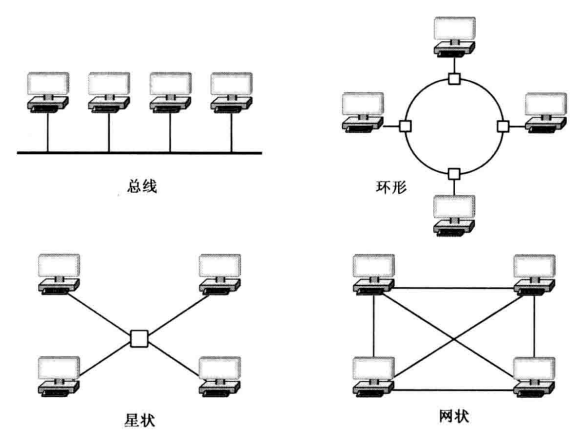
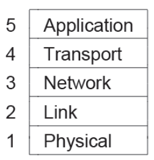
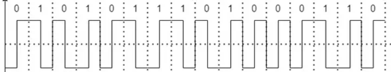
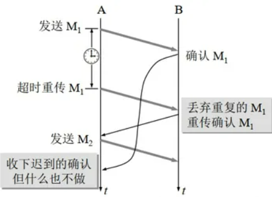
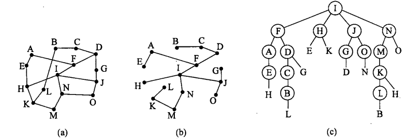

# 计算机网络

[TOC]

## 1 概论

网络：电信网络、有线电视网络、计算机网络、电网、人体内神经网络……（三网、四网融合）

计算机网络：将分散的、具有独立功能的**计算机系统**，通过**通信设备**与**线路**连接起来，由功能完善的**软件**实现**资源共享**和**信息传递**的系统。

功能：

- 数据通信
- 资源共享
- 分布式处理
  - 提高可靠性
  - 负载均衡

发展：

1. 一阶段：阿帕网（ARPANET）→ 互联网（internet）→ 因特网（Internet）
2. 二阶段：三级结构（主干网-地区网-校园网）
3. 三阶段：多层次ISP（因特网服务提供商）结构（主干ISP-地区ISP-本地ISP-校园网…）

组成：硬件+软件+协议

### 分类

1. 按分布范围：广域网（WAN）、城域网（MAN）、局域网（LAN）、个人局域网（PAN）

   - 广域网：交换技术

   - 局域网：广播技术

2. 按使用者：公用网、专用网

3. 按交换技术：电路交换、报文交换、分组交换……

4. 按拓扑结构：总线型、星型、环型、（网状型）

   

5. 按传输技术：广播式、点对点

### 性能指标

- 速率
- 带宽：最高频率与最低频率之差，单位Hz；表示传送数据的能力（最高数据率，单位b/s）
- 吞吐量
- 时延
- 时延带宽积：传播时延×带宽
- 往返时延（RTT）：传播时延×2+处理时间
- 利用率：信道利用率、网络利用率
- 抖动

### 协议层次结构

- 对等体（peer）
- 接口：定义了下层向上层提供哪些原语操作和服务
- PDU（协议数据单元）=PCI（协议控制信息）+SDU（服务数据单元）


### 参考模型

#### OSI参考模型

开放系统互连（OSI，Open Systems Interconnection）参考模型，基于国际标准化组织（ISO，International Standards Organization）的提案。

- 应用层：文件传输（FTP）、电子邮件（SMTP）、万维网（WWW）
- 表示层：数据格式变换、数据加密/解密、数据压缩/解压缩
- 会话层：有序传输：建立/终止会话、恢复通信
- 传输层：端到端：可靠/不可靠传输、差错控制、流量控制、分用、复用
- 网络层：分组/数据报：路由选择、流量控制、差错控制、拥塞控制
- 数据链路层：成帧、差错控制（帧错&位错）、流量控制、访问（接入）控制
- 物理层：定义接口特性、传输模式&速率、比特同步、比特编码


#### TCP/IP参考模型

|        | OSI             | TCP/IP          |
| ------ | --------------- | --------------- |
| 网络层 | 无连接+面向连接 | 无连接          |
| 传输层 | 面向连接        | 无连接+面向连接 |


#### 混合模型



### 网络安全

公开密钥加密（public key encryption）：**RSA**非对称加密算法/公钥加密算法：

1. 每个用户都有一对私钥和公钥
   - 私钥用来进行解密和签名，是给自己用的
   - 公钥由本人公开，用于加密和验证签名，是给别人用的
2. 数字签名：当该用户发送文件时，用私钥签名，接收方用他给的公钥验证签名，可以保证该信息是由他发送的
3. 安全传输：当该用户接受文件时，发送方用他的公钥加密，他用私钥解密，可以保证该信息只能由他看到

## 2 物理层

### 通信基础

#### 傅里叶级数

$$
g(t) = \frac{1}{2}c + \sum_{n=1}^{\infty} \left[ a_n \sin(2\pi nf t) + b_n \cos(2\pi nf t) \right]
$$

$$
a_n=\frac{2}{T}\int^{T}_{0}g(t)\sin(2\pi nft)dt\\
b_n=\frac{2}{T}\int^{T}_{0}g(t)\cos(2\pi nft)dt\\
c=\frac{2}{T}\int^{T}_{0}g(t)dt
$$

#### 通信方式

1. 根据通信方向：

   - 单工（Simplex）：广播
   - 半双工（Half-Duplex）：对讲机
   - 全双工（Full-Duplex）：电话


2. 根据传输顺序：

    - 串行传输：逐位发送，速度低、费用低，适合远距离
    - 并行传输：8位发送，速度快、费用高，适合近距离（8条信道）

3. 根据同步性：

   - 同步传输（区块传输）：先送出同步字符，再送出整批数据
   - 异步传输：分成小组传输，加字符起始位和终止位

#### 术语

- 码元：固定时长的信号波形，代表离散数值。二进制码元中为0/1，携带1bit信息量；四进制码元为00/01/10/11，携带2bit信息量。
- 带宽：
  - 模拟信号系统中（信道带宽）：最高频率-最低频率，单位Hz
  - 数字设备中：单位时间内从网络的一点到另一点，最高数据率/通过链路的数量，单位bps
- 码元传输速率（波特率、波形速率）：
  - 单位波特（Baud，B），单位时间内传输的码元个数（信号变化次数）
  - 与进制无关，只与码元长度T有关
- 信息传输速率（比特率）：bps，单位时间传输的bit数
  - 码元携带n bit信息量（即2^n进制码元），M baud波特率对应的比特率为M·n bps

### 两个定理

#### 奈奎斯特定理

- 码间串扰：由于信道的特性，码元之间可能发生相互干扰，导致码元的边界模糊，使得接收端难以正确解码。

- 奈奎斯特定理（奈氏准则）：带宽受限**无噪声**情况下，为避免码间串扰，对于信道带宽B (Hz)，V进制码元：

$$
最大波特率(Baud) = 2B\\
最大比特率(bps) = 2B·log_2V
$$

#### 香农定理

- 信号功率为S，噪声功率为N，信噪比为S/N，取对数为分贝(dB)，如100信噪比为20dB：

$$
信噪比(dB) = 10log_{10}(S/N)
$$

- 带宽受限**有噪声**条件下，香农定理：

$$
最大比特率(bps) = B·log_2(1+S/N)
$$

### 编码调制与多路复用

1. **基带传输：**
   - **数字信道**传输。基带信号通常是原始的数字信号，没有经过调制。
   - 通常不需要调制，直接用于传输
   - 基带传输适用于**短距离**通信，因为基带信号的传输会受到信号衰减和失真的影响。
2. **宽带传输、通带传输：**
   - **模拟信道**传输。涉及到信号的调制，将基带信号移动到更高的频率范围。
   - 需要调制，以将信息传递到更高频率的载波中。
   - 适用于**中距离、长距离**通信，因为可以减小信号衰减，提高信号传输的稳定性。

#### 数字数据编码为数字信号


##### 非归零编码（NRZ）

- 高电平1，低电平0
- 时钟恢复问题：无法判断一个码元的开始和结束，难以保持同步，需要一条时钟线

##### 归零编码（RZ）

- 单极性归零码：每个码元内归零，1为先高后低，0为一直低电平：

  

- 双极性归零码：高电平表示1，负电平表示0，每个周期归零电平：

  

##### 不归零逆转/反向不归零编码（NRZI）

- 1定义为信号有跳变，0定义为信号无跳变（USB2.0的NRZI相反）
- USB2.0标准采用了NRZI编码模式，不会产生时钟恢复问题

##### 曼彻斯特编码

- 一个码元分为两个间隔，前低后高为0，前高后低为1（G.E. Thomas标准）
- IEEE 802.3标准中相反，前低后高为1，前高后低为0
- 跳变既是数据信号也是时钟信号，主要用于经典以太网
- 缺点在于需要两倍带宽

##### 差分曼彻斯特编码

- 位开始边界有跳变表示0，没有跳变表示1

- 第1个比特按照对应曼彻斯特标准，第2个比特时间开始时信号未发生变化，说明第2个比特为1；第3个比特时间开始时信号发生变化，说明第3个比特为0...

- G.E. Thomas Convention:

    

- IEEE 802.3 Convention:

    

##### 4B/5B编码

- 每4个比特被映射成5个比特模式：

  

- 增加25%带宽开销，好于曼彻斯特编码的100%

##### 伪随机序列异或（XORing）

- 扰频器工作原理

##### 双极性编码（Bipolar Encoding）/ 交替标记逆转（AMI）

- 使用交替的正负电压表示二进制的1，用零电压表示二进制0
- 实现信号平衡

#### 数字数据调制为模拟信号


- （b）ASK（Amplitude shift keying，调幅）
- （c）FSK（Frequency shift keying，调频）
- （d）PSK（Phase shift keying，调相）

QAM（Quadrature Amplitude  Modulation，正交调幅）：


#### 模拟信号编码为数字信号

1. 抽样：根据奈奎斯特定理，
   $$
   f_{采样频率}\geq2f_{信号最高频率}
   $$
   
2. 量化

3. 编码

#### 模拟数据调制为模拟信号/多路复用

1. 频分多路复用FDM（Frequency Division Multiplexing）
2. 时分多路复用TDM（Time Division Multiplexing）
3. 码分多路复用CDM（Code Division Multiplexing）
4. 波分多路复用WDM（Wavelength Division Multiplexing）

### RS-232 异步字符传输

RS-232标准用于短距离异步串行通信，以一个**开始位（0）**作为每个字符前导，之后发送字符中的每个bit，每个字符的后面跟着一个比特时间的**停止位（1）**


（EIA标准规定负电压为1，正电压为0）

### ADSL

- 非对称数字用户线（Asymmetric Digital Subscriber Line）是使用最广泛也是最多住宅使用的DSL

- **频分复用**，因此可以和传统模拟电话服务（POTS）共用一根导线

- 上行频带带宽<<下行频带带宽，上行带与POTS有22kHz防护带：

  

- 不保证数据速率，上行速率<<下行速率（短距离640kbps<<8.448Mbps）

### 交换


#### 电路交换

- 在发送数据之前，需要建立一条端到端的路径（连接）；独占资源；结束后断开连接
- 优点：
  1. 时延小，适用于实时性要求高或交互式的情况
  2. 全双工通信，无冲突
  3. 无失序问题
  4. 控制简单
  5. 适用数字信号和模拟信号
- 缺点：
  1. 建立连接时间长：发出请求-多次转发-回复
  2. 线路独占，不能供其他用户使用，信道使用效率低
  3. 灵活性差，出错时只能重新建立连接
  4. 无数据存储能力，难以平滑通信量（难以应对数据激增）
  5. 数据直达，不同类型、规格、速率的终端难以相互通信
  6. 难以差错控制

#### 数据包交换/分组交换

- 数据被分割成小的数据包（不分割则为报文交换），并通过网络独立地传输。每个数据包根据网络中的路由信息独立传输，可能按照不同的路径到达目的地

- “存储-转发”技术

- 优点：
  1. 无建立连接时延
  2. 线路利用率高
  3. 加速传输（可以并行传输）
  4. 减少出错几率和重发数据量
  5. 分组短小，适用于计算机之间的突发式数据通信
  6. 简化存储管理（相比报文交换，分组长度固定）

- 缺点：
  1. 实时性差（存储-转发过程，甚至排队），不适合实时或交互式业务数据
  2. 分组要加控制信息，降低效率
  3. 可能出现失序、丢失或重复分组，要进行排序

- 数据报服务&虚电路服务：

  

### 传输介质

#### 导向性传输介质

- 双绞线（Twisted Pairs）：两根铜导线并排绞合，可以减少对相邻导线的电磁干扰，UTP（无屏蔽双绞线）、STP（屏蔽双绞线）

- 同轴电缆（Coaxial Cable）：抗干扰性更好，更贵。基带同轴电缆，用于局域网；宽带同轴电缆，用于有线电视：

  

- 电力线（Power Lines）

- 光纤（Fiber Optics）：带宽非常大（可见光频率10^8MHz），损耗小，抗电磁干扰性能好，保密性好，重量轻，信号源有LED和半导体激光：

  

- 光缆（Fiber Cables）

#### 非导向性传输介质

- 无线电波：信号向所有方向传播，穿透力强，可传远距离
- 微波：信号向固定方向传播，频率高，频段宽，数据率高
- 红外线、激光：信号向固定方向传播，要转换为红外光信号/激光信号再传播

#### 卫星


### 物理设备

#### 中继器（Repeater）

- 对信号进行再生和还原，对衰减的信息进行放大
- 不会存储转发
- 两端的网络部分是网段而非子网，必须是同一协议
- 5-4-3规则

#### 集线器（Hub，多口中继器）

- 放大，并转发到除输入端口外的所有端口（星型拓扑）
- 共享式设备，不具备定向传送能力
- 不能分割冲突域
- 被交换机取代

## 3 数据链路层

### 功能

1. 为网络层提供服务：

   - 无确认的无连接服务

   - 有确认的无连接服务

   - 有确认的有连接服务

2. 链路管理：面向连接的服务连接的建立、维持、释放

3. 组帧

4. 流量控制

5. 差错控制

### 成帧


#### 字节计数法


- 用第一个字节（8位）来标明帧内字节数
- 问题在于：如果计数字节错误，则全部错误

#### 字节填充的标志字节法

- 每个帧用标志字节（flag byte）作为开始和结束

- 传输二进制数据时会干扰帧分界，解决方案是在数据中出现的标志字节前加入转义字节（ESC）；如果转义字节出现，也用转义字节填充

- 接收方删除转义字节即可得到原始数据

- **PPP协议**（Point-to-Point Protocol）中：

  

#### 比特填充的比特字节法

- 只使用8bit标识符`0111110`（或`0x7E`）

- 每当发送方在数据中连续遇到5个1，则添加一个0：

  

- 接收方每看到连续的5个1则删除一个0

- USB采用此技术

#### 物理层违规编码法

- 曼彻斯特编码中，用“高-高”或“低-低”这两个不会用到的编码来界定帧的起止
- 其他如4B/5B编码等
- 许多数据链路协议为安全起见综合使用了这些方法

### 差错控制

#### 检错码

##### 奇偶校验码（Parity）

- 在字节中增加一个额外的位，检验1的个数的奇偶
  - 奇校验：加一位使得1总数为奇
  - 偶校验：加一位使得1总数为偶

- 检错能力只有50%

##### 校验和（Checksum）

- 将数据中的每个字节相加来生成一个检验值，并附加到原始数据中一起传输

##### 循环冗余校验码（CRC）

- Cyclic Redundancy Check，也称多项式编码（polynomial code）

- 将位串看成是系数为0或1的多项式，如1101代表：
  $$
  x^3+x^2+1
  $$

- 生成方式：

  1. 发送方和接收方预先商定一个生成多项式G(x)，其最高和最低位必须为1，阶数（位数-1）为r
  2. 在帧的低位加上r个0
  3. 增长后的帧除以生成多项式（**异或**，相同为0），余数为冗余码
  4. 最终发送的数据=增长后的帧+冗余码


- 接收方式：除以G(x)，若余数不为0则说明错误
- r阶多项式可以检测所有长度小于等于r的突发错误（即连续错误）

#### 纠错码

##### 海明码

- 海明距离（码距）：两个码字中不相同的位的个数；一个编码集中任意两个码字的海明距离的最小值为该编码集的海明距离

- 检测d个错误，需要码距为d+1

- 纠正d个错误，需要码距为2d+1

- 海明码流程（以1000001为例）：

  

  1. 确定校验码位数r，校验码有2^r种取值

     数据/信息为m位，**海明不等式**：
     $$
     2^r\geq m+r+1
     $$
     此处r=4

  2. 校验码放在序号为2^n的位置上，原数据按顺序填入:

     | 序号 | 11   | 10   | 9    | 8    | 7    | 6    | 5    | 4    | 3    | 2    | 1    |
     | ---- | ---- | ---- | ---- | ---- | ---- | ---- | ---- | ---- | ---- | ---- | ---- |
     | 值   | 1    | 0    | 0    | x4   | 0    | 0    | 0    | x3   | 1    | x2   | x1   |

  3. 求校验码，默认采用偶校验：

     - x4负责（1***），即第11~8位，为1
     - x3负责（*1**），即第7~4位，为0
     - x2负责（\**1\*），即第11、10、7、6、3、2位，为0
     - x1负责（***1），即第11、9、7、5、3、1位，为0

     | 序号 | 11   | 10   | 9    | 8    | 7    | 6    | 5    | 4    | 3    | 2    | 1    |
     | ---- | ---- | ---- | ---- | ---- | ---- | ---- | ---- | ---- | ---- | ---- | ---- |
     |      | 1011 | 1010 | 1001 | 1000 | 0111 | 0110 | 0101 | 0100 | 0011 | 0010 | 0001 |
     | 值   | 1    | 0    | 0    | 1    | 0    | 0    | 0    | 0    | 1    | 0    | 0    |

  4. 假设第5位错，即接收方接收到的是10010010100，四位冗余码校验结果是0101（出错为1），表明第5位出错，数据还原为1000001

##### 卷积码


### 流量控制与可靠传输

#### 停止-等待协议

- 每发送完一个帧就停止发送，等待对方确认，收到确认后发送下一帧

- 发送窗口大小=接收窗口大小=1

- 发送方发送帧0，接收方返回ACK0，然后发送方发送帧1……

  

- 优点：简单

- 缺点：信道利用率太低

- 有差错情况：

  1. 数据帧丢失或检测到帧出错：【自动重传请求 ARQ (Automatic Repeat Request)】每发送一个帧启动一个超时计时器，重传时间>传输平均RTT，超时则重传数据帧；数据帧和确认帧必须编号

  2. ACK丢失：超时重传，接收方丢弃重复的帧

  3. ACK迟到：丢弃迟到的ACK

     


#### 信道利用率


信道利用率（数据率为c，帧长度为L）：
$$
U=\frac{T_D}{T_D+RTT+T_A}=\frac{\frac L c}{\frac L c+RTT+T_A}
$$
信道吞吐率 = 信道利用率*发送速率

#### 滑动窗口协议/连续ARQ协议

流水线传输，显著提高利用率


#### 回退N帧协议（GBN）


- 发送窗口大小>1；接收窗口大小=1

- 若采用n比特编号，发送窗口大小应满足：
  $$
  1\leq W_T\leq 2^n -1
  $$
  因为发送窗口过大, 会使得接收方**无法区别新帧和旧帧**

- 接收方**丢弃**所有到达的后续帧，而且对这些帧不返回ACK（假设3号帧发送出错，则接收方丢弃4、5…号帧并一直返回ACK2）

- 累计确认：ACKn代表接收方已经收到n号帧及之前的全部帧

- 缺点：在某些质量差的信道中会极大降低信道利用率

#### 选择重传协议（SRP）


- 发送窗口大小>1；接收窗口大小>1

- Selective Repeat Protocol，只重传出错的帧，因此需要加大接收窗口的长度，缓存乱序到达的帧

- 接收方：对于窗口内的帧，不管帧是否按序，都缓存并返回一个确认帧，直到所有（序号更小的）帧都被收到再交付给上层并向前滑动

- 若采用n比特编号，发送窗口大小和接收窗口应满足：
  $$
  W_{Tmax}=W_{Rmax}=2^{n-1}
  $$

### 数据链路协议实例

- SONET（Synchronous Optical Networking）是一种光纤通信的同步传输技术，主要用于长距离的高速数据传输
- ADSL（Asymmetric Digital Subscriber Line）是一种用于家庭和企业宽带接入的数字订阅线技术
- SONET和ADSL都采用了PPP

### 数据链路层设备与域

1. 网桥：根据目的MAC地址对帧转发和过滤（而非向所有接口转发）

2. 多接口网桥——以太网交换机

3. 冲突域：其中每一个节点都能收到所有被发送的帧，同一时间内只能有一台设备发送信息的范围

4. 广播域：其中所有设备能接受任一设备的广播帧

   | 设备                         | 能否隔离冲突域 | 能否隔离广播域 |
   | ---------------------------- | -------------- | -------------- |
   | 物理层设备（中继器、集线器） | N              | N              |
   | 链路层设备（网桥、交换机）   | Y              | N              |
   | 网络层设备（路由器）         | Y              | Y              |

## 3.5 介质访问控制子层

- 数据链路层的一个子层，称为介质访问控制（MAC，Medium Access Control）子层
- 采取一定措施，使得两对节点之间的通信不会相互干扰
- 分为静态划分信道和动态分配信道
  - 静态划分信道采用信道划分介质访问控制
  - 动态分配信道采用轮询/随机访问介质访问控制

### 信道划分介质访问控制

1. 频分多路复用FDM（Frequency Division Multiplexing）
2. 时分多路复用TDM（Time Division Multiplexing）
3. 统计时分多路复用STDM（Statistical Time Division Multiplexing）
4. 码分多路复用CDM（Code Division Multiplexing）
5. 波分多路复用WDM（Wavelength Division Multiplexing）
6. 密集波分多路复用WDM（Dense Wavelength Division Multiplexing）

### 载波侦听多路访问协议/随机接入协议

#### ALOHA协议

##### 纯ALOHA协议

- 思想：不监听信道，不按时间槽发送，随机重发，想发就发
- 如果帧被损坏了，则发送方要等待一段随机时间后再次发送该帧，等待的时间必须是**随机**的


##### 时隙/分槽ALOHA协议

- 把时间分成若干时间槽（slot）
- 若发生冲突，必须等下一个时间槽开始再发送
- 吞吐量更高，效率更高


#### CSMA协议

- 载波侦听多路访问协议，Carrier Sense Multiple Access

  - CS：载波监听，每一个站发送数据前检测总线上是否有其他计算机在发送数据
  - MA：多点接入

- 思想：发送帧之前**监听**信道。信道忙时推迟发送；信道空闲时发送帧，有三种协议：

  | 协议                                  | 信道空闲                                   | 信道忙                                   | 优点                                   | 缺点                                 |
  | ------------------------------------- | ------------------------------------------ | ---------------------------------------- | -------------------------------------- | ------------------------------------ |
  | **1-坚持CSMA**（1-persistent CSMA）   | 马上发送                                   | 继续坚持监听                             | 利用率高                               | 会发生冲突                           |
  | **非坚持CSMA**（non-persistent CSMA） | 马上发送                                   | 放弃监听，等待一段**随机**时间后再次监听 | 减少冲突发生的可能性                   | 利用率低（都在等待）                 |
  | **p-坚持CSMA**（p-persistent CSMA）   | 以概率p发送数据，以概率1-p等待一个时间间隔 | 继续坚持监听，直到空闲时再以p概率发送    | 最好的方案，既减少冲突，又减少空闲时间 | 冲突发生后仍发送完整数据帧，造成浪费 |

#### CSMA/CD协议

- 带冲突检测的CSMA，CSMA with Collision Detection，由以太网提供的3种新方法组成：

  1. 载波侦听
  2. 冲突检测
  3. 二进制指数退避

- 边发送边检测，检测到冲突时马上停止

- 传播时延对载波监听的影响：假设AB传播时延（总线端到端传播时延）为`τ`，A在0时刻开始传输，B在`τ-ε`时刻检测到冲突，`2τ-ε`返回A，即最迟`2τ`确定是否冲突

  `2τ`：争用期/冲突窗口/碰撞窗口/总线端到端往返传播时延/等效分槽ALOHA时间槽宽度

- 最小帧长问题（以太网最小64B，更小的认为是冲突造成的无效帧）：
  $$
  帧长 \geq 2\tau·数据传输速率
  $$

- 重传机制：**二进制指数退避**算法（Binary Exponential Backoff Algorithm）：
  $$
  k=min[重传次数, 10]\\
  r=random\{0,1,...,2^k-1\}\\
  退避时间=2r·\tau
  $$

#### CSMA/CA协议


- 带冲突避免的CSMA，CSMA with Collision Avoidance

- 基本通信方式：若信道空闲则等待一个DIFS，若结束后依旧空闲，立即发送DATA

- 用于无线局域网

- **隐藏终端**问题（a）：A无法知道C正在给B发送数据，造成碰撞

- **暴露终端**问题（b）：A正在给D（未显示）发送，但B受到影响，于是无法给C发送数据

  

- **RTS/CTS**方式：

  1. 忙则等待（退避计时器）；空闲则等待一个**DIFS**（Distributed Inter-Frame Space），若依旧空闲则发出（广播）**RTS**（request to send），包括发送、接收端地址、下份数据**持续时间**（NAV，网络分配向量Network  Allocation Vector）
  2. 接收端收到RTS后发送（广播）**CTS**（clear to send）；其他站收到RTS后重新设置NAV
  3. 发送方收到CTS后，再等待一个**SIFS**（Short Inter-Frame Space），发送数据帧；其他站收到CTS后重新设置NAV
  4. 接收方收到数据帧后，CRC校验，正确则发送**ACK**
  5. 发送方收到ACK后发送下一帧，否则重传（二进制指数退避算法）

### 无冲突协议

#### 轮询协议

主设备轮询子设备，“邀请”其发送数据

缺陷：开销大，等待延迟高，主设备单点故障导致系统崩溃

#### 令牌传递协议

流程：

1. **令牌传递：** 一个特殊的令牌数据包在网络中沿着一个逻辑环路传递。只有拥有令牌的设备才有权发送数据。
2. **数据传输：** 一旦设备获得令牌，它可以发送数据。发送数据的设备将数据包传递到下一个设备，并释放令牌。
3. **令牌重新传递：** 接收数据的设备在发送完数据后将令牌传递给下一个设备，以便下一个设备有机会发送数据。


优点：公平分配带宽，无冲突，适用于负载较重、通信量较大的网络

缺陷：开销大，等待延迟高，单点故障导致系统崩溃

#### 位图协议


每个竞争周期包含N个时槽，j号站要发送时在j号槽插入1位来声明自己要发送。经过所有N个槽后，按照此数字顺序进行传送，都结束后开始另一个N位竞争周期。由于每个站都同意下一位谁来发送，所以不会发生冲突

- 低负载情况下（仅一站发送），d为数据长度：信道利用率=d/(N+d)
- 高负载情况下（所有站任何时候都有数据发送）：信道利用率=d/(1+d)
- 最大延迟分析：若最后的N−1号用户要发数据，则需要等待前面N+(N−1)d发送完
- 缺点：无法考虑优先级

#### 二进制倒计数协议


每个站要发送数据时，以二进制位串的形式广播自己的地址。上图中，站0010、0100、1001、1010在位时间0分别准备发送，于是发送0、0、1、1，OR运算得到1，0010和0100随即得知有高序站在竞争信道，因而放弃发送，同理1001也随后放弃，于是1010（最高序号）能够发送数据

假设有N个站，帧长d，则利用率为
$$
\frac{d}{d+log_2N}
$$
如果精心设计帧格式，使得每个帧的帧头为发送地址，即竞争的同时也在发送。则效率为100%

### 有限竞争协议

为不同的站分配不同的概率，假设有k个站，每个站在每个时间槽的传输概率为p，p的最佳值为1/k，此时
$$
成功概率=({\frac{k-1}k})^{k-1}
$$
站数较少时成功概率高，高于5个后逼近值1/e


### 以太网 Ethernet（IEEE 802.3）

- 便宜简单、满足速率要求（10Mbps~10Gbps）、应用最广泛
- 两个标准：Dix标准、IEEE 802.3标准（802.3局域网 AKA 以太网）
- 提供**无连接**、**不可靠**服务：
  - 无连接：无“握手”
  - 不可靠：接收方不确认，差错帧直接丢弃，纠正由高层负责
  - 无差错≠可靠

#### 帧格式


- 目标地址第一位是0表明是普通地址，1表明是组地址（组播，multicasting）； 全1组成的特殊地址保留用作广播（broadcasting），帧被网络上的所有站接收
- 类型（Type）/ 长度（Length）
- 数据（Data）字段最多**1500**字节
- 以太网帧至少**64**字节，不足则使用填充字段（最多**46**字节）
- 校验和为32位CRC

#### 经典以太网

使用1-坚持CSMA/CD协议，10Mbps


#### 高速以太网 fast Ethernet

1. 100BASE-T以太网：双绞线、100Mbps、CSMA/CD协议，支持全双工&半双工
2. 吉比特以太网/千兆以太网（gigabit Ethernet）：光纤或双绞线、1Gbps，支持全双工&半双工
3. 10吉比特以太网/万兆以太网（10 gigabit Ethernet）：光纤、10Gbps，只支持全双工

### WLAN（IEEE 802.11）

- IEEE 802.11

- 使用CSMA/CA协议

- 两种架构：

  - (a)有架构/**基础结构型**模式（infrastructure）：一台无线主机只与一个接入点通信，接入点转发所有分组
  - (b)**自组织**模式（Ad hoc network）：无基站，无线主机之间互相通信 
  
  
  

#### MAC帧格式


地址1（destination）为AP的MAC地址，地址2（source）为发送者MAC地址，地址3（dest.2）为目的（路由器）MAC地址，地址4用于自组织模式

### PAN（IEEE 802.15）


蓝牙：**802.15.1a**，使用**2.4Ghz**频段，短距离

## 4 网络层

- 分组（数据报）端到端

### IP协议

#### IP数据报

##### IPv4数据报格式

IP数据报=首部（固定部分20字节）+数据部分（TCP/UDP）

IPv4数据报首部：


- IHL（首部长度）：以32位（**4字节**）为单位，最小值为5，最大值为15
- 总长度：首部长度+数据部分长度，最大65535字节
- 选项：最多40字节
- 标识：确定新到达的分段属于哪个数据报
- DF：不分段，Don't Fragment 
- MF：更多段，More Fragment
- 偏移量：该段在数据报中的位置，以8B为单位，每个数据报最多2^13=8192个段
- 协议：TCP=6，UDP=17
- 首部检验和：只检验首部
- 源/目标IP地址：**32位**

##### 分片

链路层最大传输单元MTU（在以太网中为1500B），超过部分就要分片

e.g.

原数据报20B+3800B，要求分片长度不超过1420B，所以分为以下三片：

| 分片 | 首部 | 数据部分 | 标识 | MF   | DF   | Offset |
| ---- | ---- | -------- | ---- | ---- | ---- | ------ |
| 1    | 20B  | 1400B    | 123  | 1    | 0    | 0      |
| 2    | 20B  | 1400B    | 123  | 1    | 0    | 175    |
| 3    | 20B  | 1000B    | 123  | 0    | 0    | 350    |

#### IPv4地址

##### 前缀&子网掩码


- **32位**/4B，每个字节写成十进制（点分十进制）
- **CIDR**（无类域间路由/无分类编址，Classless Inter-Domain Routing）：网络前缀+主机号，前缀长度写在最后`/16`（读作slash 16）
- 子网掩码：前缀1的数量与网络前缀长度相同，与IP地址作AND运算得到子网
- 超网：网络前缀缩短（取交集）
- 最长前缀匹配

##### 原始分类寻址


D类地址用于组播，一个D类地址表示一个组播组，只能作目标地址

E类保留

##### 特殊IP地址

| 网络号 | 主机号            | 作为IP分组源地址 | 作为IP分组目的地址 | 用途                                                 |
| ------ | ----------------- | ---------------- | ------------------ | ---------------------------------------------------- |
| 全0    | 全0               | 可以             | 不可以             | 本地网络中表示主机；路由表中表示默认路由（整个网络） |
| 全0    | 特定值            | 可以             | 不可以             | 本地网络中某个特定主机                               |
| 全1    | 全1               | 不可以           | 可以               | 本地网络广播                                         |
| 特定值 | 全0               | 不可以           | 可以               | 一个特定网络                                         |
| 特定值 | 全1               | 不可以           | 可以               | 特定网络广播                                         |
| 127    | 任意（非全0/全1） | 可以             | 可以               | 回环                                                 |

#### NAT

私有IP地址（Internet上的路由器不进行转发）：

| 类别 | 范围                             | 网段个数 |
| ---- | -------------------------------- | -------- |
| A类  | 10.0.0.0~10.255.255.255/8        | 1        |
| B类  | 172.16.0.0~172.31.255.255.255/12 | 16       |
| C类  | 192.168.0.0~192.168.255.255/16   | 256      |

NAT路由器维护NAT转换表，将内部IP地址和端口转换为Internet上的IP地址和端口：


#### IPv6

- **128位**（16B）IP地址，首部长度必须是**8B**的整数倍

  

- 自动配置，不需要DHCP

- 压缩形式：连续的0可以被省略，一串连续的0可以用冒号取代（FF05:0:0:0:0:0:0:B3→FF05::B3）

- 双栈协议：同时启用IPv4和IPv6协议栈

- 隧道技术：IPv4和IPv6重新封装


### Internet控制协议

#### ARP

- 地址解析协议（Address Resolution Protocol）

- ARP高速缓存中存储IP地址与MAC地址的映射

- 情况：

  1. 发送给本网络的主机，ARP找到目标主机MAC
  2. 发给另一网络的主机，ARP找到本网络上一个路由器（网关）MAC

- 若没有对应表项，则广播ARP请求分组（目的MAC地址为全1）：

  

- 封装：封装在一个硬件帧中

  

#### ICMP


- Internet控制信息协议（Internet Control Message Protocol）
- 放置在IP数据报的数据部分
- 异常（差错）报告，ICMP差错不会再发送ICMP
- 网络探询（ping/traceroute）

#### IGMP

组播协议

#### DHCP

- 动态主机配置协议（Dynamic Host Configuration Protocol）
- 客户端和服务器通过广播进行交互，基于UDP
- DHCP服务器收到请求（DHCP DISCOVER包）后，为主机分配空闲的IP地址（DHCP OFFER包），使用MAC标识
- 租赁（leasing）技术

### 路由协议与算法

- 静态路由（非自适应路由）：管理员手工配置，不适用大型网络
- 动态路由（自适应路由）
- AS（自治系统）：一组路由器，域内用内部网关协议IGP（Interior Gateway Protocol，包括OSPF、RIP），域间用外部网关协议EGP（Exterior Gateway Protocol，包括BGP）

#### RIP

- Routing Information Protocol，路由信息协议
- **距离矢量路由**（distance vector routing，DVR）/Bellman-Ford/D-V算法：每个路由器维护从自己到其他每一个目的网络的最佳距离和链路记录。表通过邻居之间相互交换信息而不断更新
- 距离/**跳数度量**：跳数（hop）为从源端口到目的端口所经历的路由器个数，**直连为1，16表示不可达**（RIP允许一条路由最多15个路由器）
- 用**UDP**不可靠传输
- 只适用于小型互联网

**交换**：


- 仅和**相邻**路由器交换

- 刚开始工作时只知道直连网络距离，每30s交换一次，若180s没收到则判定邻居没了

- 好消息传的快，坏消息传的慢（无穷计数问题）：

  

  B没有收到A，但误以为C有一条长度为2的正常路径，于是将到A的距离更新为2+1=3，……，直到最后所有路由器到A都会趋近无穷大，根本原因是不知道路径信息。一个改良方案是将无穷大定义为**最长路径+1**

#### OSPF

- Open Shortest Path First，开放最短路径优先
- 使用了**链路状态路由**（link state routing，LSR）算法和**Dijkstra**最短路径算法（SPF）
- 信息量大，直接采用**IP**

**链路状态路由算法**：

1. 每个路由器发送HELLO问候分组，了解邻居节点
2. 设置到每个邻居的成本度量metric
3. 构造数据库描述（DD）分组，向邻居给出自己的链路状态数据库中的摘要信息
4. 若DD中的摘要自己都有，则不处理；否则发送链路状态请求（LSR）分组
5. 收到LSR，发送链路状态更新（LSU）分组
6. 更新完成后，发送链路状态确认（LSACK）分组
7. Dijkstra构造最短路径

#### BGP

- Border Gateway Protocol，边界网关协议
- 使用**TCP**交换路由信息
- 首次交换整个路由表，之后交换变化部分

#### 广播路由

I发出广播：

逆向路径转发（reverse path forwarding）：如图（c），共5跳，4+8+6+4+2=24个数据包

生成树（spanning tree）：如图（b），共4跳，14个数据包；需要事先知道生成树（如链路状态路由）



### 服务质量QoS

#### 漏桶&令牌桶


漏桶：恒定速率出桶

令牌桶：恒定速率产生令牌，发送数据包必须领取一个令牌

## 5 传输层

- 进程与进程间的通信

- 分用&复用

- 端口号：

  - 服务端端口号：熟知端口号（0\~1023）、登记端口号（1024\~49151）

    

  - 客户端端口号：49152\~65535

- 套接字（Socket）= (主机IP地址, 端口号)

### UDP

- User Datagram Protocol，用户数据报协议
- 特点：
  1. **无连接**，减少开销和时延
  2. **端到端**，能区分计算机上的应用程序
  3. **最大努力交付**（尽力传递语义），不保证可靠交付
  4. **面向报文**，适合一次传输少量数据的应用
  5. 无拥塞控制
  6. 首部开销小，8B
  7. 允许交互模式和广播模式（一对一/一对多/多对一/多对多）

#### UDP格式

首部（8字节）：


封装：封装在IP数据报中


IPv4伪首部（12字节，计算校验和时出现）：


### TCP

- Transmission Control Protocol，传输控制协议
- 特点：
  1. **面向连接**，虚连接
  2. **点对点**（套接字），端到端
  3. **可靠**有序，不丢不重
  4. **全双工**通信，发送/接收缓存
  5. 流接口

#### TCP报文段格式

首部固定20字节，数据部分最多为65535-20（IP头）-20（TCP头）=65495字节


- TCP头长度（数据偏移）指明TCP头包含多少个32位，因为选项部分是变长的
- 控制位：
  1. URG (Urgent Pointer)：紧急指针
  2. ACK (Acknowledgment)：确认字段是否有效
  3. PSH (Push Function)：接收方应该立即将接收到的数据交给应用层
  4. RST (Reset Connection)：重置连接
  5. SYN (Synchronize Sequence Numbers)：是建立连接请求/接收报文
  6. FIN (Finish)：发送方已经完成发送数据

#### TCP连接建立/三次握手


1. 客户端发送连接请求，进入**SYN-SENT**状态，**SYN=1，seq=x**（随机），ACK=0，ack无意义
2. 服务器端分配缓存和变量，进入**SYN-RCVD**状态，确认报文段：**SYN=1，ACK=1，ack=x+1，seq=y**（随机）
3. 客户端分配缓存和变量，进入**ESTABLISHED**状态，并返回确认的确认：**SYN=0，ACK=1，ack=y+1，seq=x+1**
4. 服务器端收到确认，进入**ESTABLISHED**状态，开始数据传输

SYN洪泛攻击（SYN flood）：不断发送第一个数据包但不确认，服务器返回ACK后进入半连接状态，浪费资源

解决方法：设置SYN Cookie

#### TCP连接释放/四次挥手

##### 两军对垒问题


两军对垒问题**无解**：1号军向2号军发送消息，2号军发送确认消息但不知道自己的确认信息是否被1收到；如果1号再发送确认信息，则1号无法确定确认信息是否被收到……

##### 四次挥手


1. 客户端发送连接释放报文段，进入**FIN-WAIT-1**状态：**FIN=1，seq=u**（之前传送的数据的最后一个序号+1）
2. 服务器端，进入**CLOSE-WAIT**状态，回复确认报文段：**ACK=1，ack=u+1，seq=v**
3. 客户端收到回复后，进入**FIN-WAIT-2**状态，等待连接释放报文
4. 服务器发送连接释放报文段，进入**LAST-ACK**状态，客户端未发送数据，所以确认号不变：**FIN=1，ACK=1，ack=u+1，seq=w**
5. 客户端收到连接释放报文后确认，进入**TIME-WAIT**状态，**ACK=1，ack=w+1，seq=u+1**
6. 服务器收到确认，立即进入**CLOSED**状态
7. 客户端等待**2MSL**（最长报文段寿命）后进入**CLOSED**状态（避免第4个报文段丢失，需要重新接受第3个报文段）

TCP连接管理有限自动机：


#### TCP可靠传输

**重传计时器RTO**（Retransmission TimeOut）

**累计确认**：只有当确认字节之前的所有数据都到达之后才能发送确认。e.g. 收到0、1、2、4则一直发送ACK2，3到达后发送ACK4

**动态重传时间**算法：维护一个SRTT（Smoothed Round-Trip Time，平滑的往返时间），代表往返时间的当前最佳估计值，对于往返时间R；α是老RTT所占比值，一般为7/8；β一般为3/4
$$
SRTT=\alpha SRTT +(1-\alpha)R\\
RTTVAR(往返时间变化)＝\beta RTTVAR + (1- \beta ) |SRTT- R | \\
RTO(重传计时器) = SRTT + 4RTTVAR
$$
**冗余确认**（冗余ACK）：比期望序号大的失序报文段到达时，接收方发送冗余ACK，指明期待序号。 e.g. 接收方收到1、3、4、5，每次都发送ACK2

#### TCP流量控制/滑动窗口


接收方动态调整发送方窗口大小，接收方缓冲区满（窗口为0）时需要等待上层应用进程取走缓存数据。此时有两种意外情景：

1. 紧急数据仍可以发送，如kill掉运行的某一个进程
2. 发送端发送一个1字节的段（窗口探测，window probe），强制接收端宣告下一个期望的字节和窗口大小，防止窗口更新数据包消失后发生死锁

存在问题：

1. 发送方发送多个小数据包：

   - 41字节TCP段只包含1字节数据
   - **Nagle算法**：只发送第一次的数据，缓存后面的数据，直到第一次数据包被确认将缓冲区数据放在一个TCP段中发送，并继续缓存……
   - 不适用于网络游戏等需要快速、稳定响应的应用
   - 可能会与延迟确认相互作用造成死锁

2. **低能窗口综合症**（silly window syndrome) ：接收端的交互式应用每次仅读取一个字节数据

   

   Clark算法：禁止接收端发送1字节的窗口更新段，必须等待一段时间到有一定可用空间后再发送（如缓冲区一半为空）

#### TCP拥塞控制


接收窗口（rwnd）：根据接收缓存设置的值，并告知发送方，放映接收方容量

拥塞窗口（cwnd）：根据自己估算的网络拥塞程度而设置的值，反映当前网络容量

有效窗口大小=min(rwnd, cwnd)

##### 慢启动/慢开始

1. 每经过一个传输轮次（往返时延RTT），cwnd**指数**增长（1、2、4、…个MSS），直到到达一个阈值（**ssthresh**）
2. 到达ssthresh后开始**线性**递增
3. 到达网络拥塞（丢包）后，立刻把当时的**cwnd/2**作为新的ssthresh
4. 之后同上

##### 快重传/快恢复

发生拥塞后如果收到了**3个**重复确认（冗余ACK），执行快重传算法，cwnd降到新的ssthresh

## 6 应用层

### DNS

域名系统，Domain Name System

#### 域名

从后往前依次是：

1. 根
2. 顶级域名：
   - 国家域名`.cn`、`.us`…
   - 通用顶级域名`.com`、`.org`…
3. 二级域名：
   - 类别：`.gov`、`.edu`…
4. 三级域名
5. ……

#### 域名解析

##### 域名服务器

1. 根域名服务器
2. 顶级域名服务器
3. 权限域名服务器
4. 本地域名服务器

##### 域名解析过程

- **递归查询：**
  1. 本地域名服务器
  2. 请求根域名服务器
  3. 请求顶级域名服务器
  4. 请求权限域名服务器
  5. ……
  6. 返回给顶级域名服务器
  7. 返回给根域名服务器
  8. 返回本地域名服务器
- **迭代查询：**
  1. 查询本地域名服务器
  2. 本地域名服务器查询根域名服务器
  3. 本地域名服务器查询顶级域名服务器
  4. 本地域名服务器查询权限域名服务器
  5. ……

#### 域名资源记录

每条记录是一个五元组：

```
(Domain_name, Time_to_live, Class, Type, Value)
```

- Time_to_live：稳定的记录值较大，如86400；不稳定的较小，如60

- Class：对于Internet信息总是IN

- Type：

  

### 电子邮件

#### SMTP

- Simple Mail Transfer Protocol，简单邮件传输协议
- 连接确立-邮件发送-连接释放，用TCP协议
- SMTP主要负责从发件人的邮件客户端将邮件传递到接收人的邮件服务器，而接收人可以使用其他协议（如POP3或IMAP）来检索这些邮件
- 缺陷：
  - 仅限于传送7位ASCII码，不能传送其他文字
  - 不能传送可执行文件或其他二进制文件
  - 不能传送超过一定长度的邮件

#### MIME

- 多用途Internet邮件扩展（Multipurpose Internet Mail Extensions）
- 将非ASCII码内容转化为ASCII码内容

#### POP3

- Post Office Protocol version 3，一种用于从邮件服务器接收电子邮件的协议
- 允许用户通过邮件客户端（如Outlook等）从邮件服务器上下载电子邮件到本地计算机，随后可以在本地离线阅读这些电子邮件。

#### IMAP

- Internet Message Access Protocol，比POP3更复杂
- 当用户PC上的IMAP客户端程序打开IMAP服务器邮箱时，可以看到邮件首部；若用户需要打开邮件，邮件才传到PC上
- 支持在多个设备上同步邮件状态

### 万维网&HTTP

- World Wide Web，WWW
- URL（Uniform Resource  Identifiers，统一资源标识符）形式：`<协议>://<主机>:<端口>/<路径>`
- HTML
- HTTP（Hypertext Transfer Protocol，超文本传输协议）：
  - 默认端口80
  - 明文协议，不安全
  - 无状态协议，每个请求和响应之间是相互独立的，不保存状态信息。它基于请求-响应模型，客户端发送请求，服务器返回响应
  - 采用TCP作为运输层协议，但HTTP本身是无连接的（交换HTTP报文前不需要建立HTTP连接）
  - Cookie存储在客户端，Session存储在服务器端
- HTTPS（Hypertext Transfer Protocol Secure）：
  - 默认端口443
  - 使用SSL/TLS协议对数据进行加密，安全

### FTP

- File Transfer Protocol，文件传输协议
- Trivial File Transfer Protocol，简单文件传输协议
- FTP基于C/S
- FTP使用TCP实现可靠传输
- 传输模式：文本模式（ASCII模式）、二进制模式
- 工作原理：
  - 主动方式：客户端向服务器的标准FTP控制端口（默认为21）发起连接请求，并指明要使用主动模式。服务器使用的数据端口为20
  - 被动方式：客户端向服务器的标准FTP控制端口（默认为21）发起连接请求，并指明要使用被动模式。服务器在一个随机端口（通常大于1024）上等待客户端的数据连接请求。
