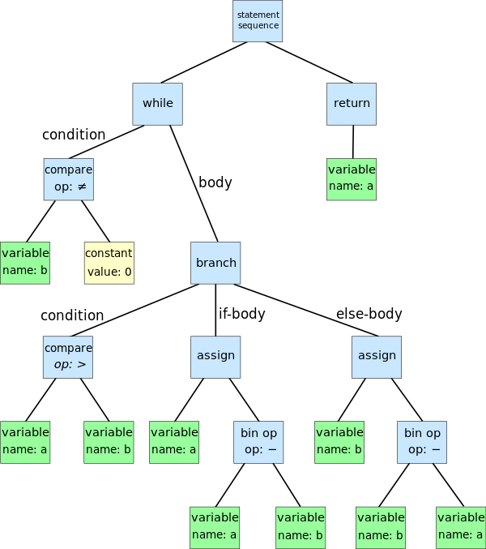

[官网](https://javaparser.org/) [中文版文档](https://houbb.github.io/2020/05/29/java-ast-03-javaparser-intro)

## AST

Abstract Syntax Tree，抽象语法树

”抽象“是指语法不会表示出真实语法的每个细节，如条件跳转语句`if-condition-then`用三分支节点表示。



上图是以下辗转相除法的AST：

```
while b ≠ 0:
    if a > b:
        a := a - b
    else:
        b := b - a
return a
```

## JavaParser

### Maven

```xml
<dependency>
    <groupId>com.github.javaparser</groupId>
    <artifactId>javaparser-symbol-solver-core</artifactId>
    <version>LATEST</version>
</dependency>
```

> 从3.5.10以后，JavaParser包含了JavaSymbolSolver，用于分析AST

```java
public class VoidVisitorStarter {
    private static final String FILE_PATH =
            "src/main/java/org/javaparser/examples/ReversePolishNotation.java";
    public static void main(String[] args) throws Exception {
        CompilationUnit cu = StaticJavaParser.parse(Files.newInputStream(Paths.get(FILE_PATH)));
    }
}
```

