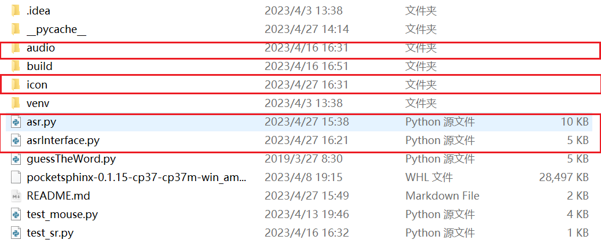
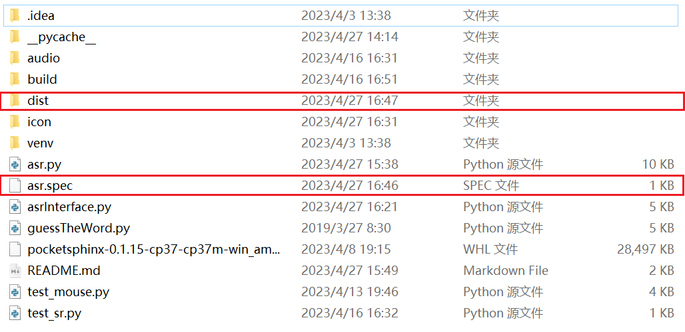
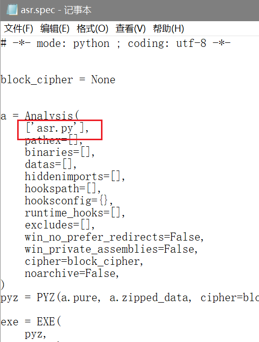
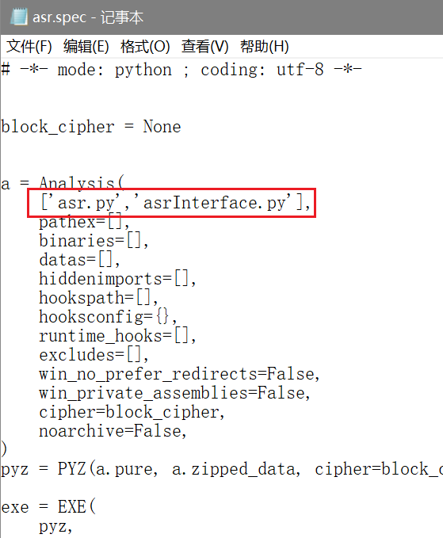
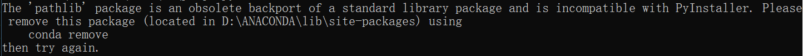

### Pyinstaller打包Python多文件流程

#### 准备步骤

安装`pyinstaller`:

```
pip install pyinstaller
```

看这个文件夹，需要打包的内容是`asr.py`（main文件）和asrInterface.py（GUI界面文件）两个文件，程序内有用到`icon`和`audio`两个文件夹内的东西，别的不需要（懒得新开一个文件夹写了）



#### 生成spec文件

`spec`是安装配置文件，作用是对可执行文件进行配置。

```
pyinstaller -F asr.py
```

有需要就添加的参数：

- `-F` 表示覆盖
- `-w` 表示不要控制台窗口
- `-i xxx.ico` 表示用`xxx.ico`作为`icon`图标

成功后会有提示：


这时可以看到多出了一个`dist`文件夹和一个`spec`文件



`dist`文件夹里会有一个`exe`文件，但现在还用不了

#### 编辑spec文件

打开`spec`文件，把所有要用的`python`程序写进对应的位置




#### 对spec文件打包

```
pyinstaller asr.spec
```

这里不要加 -F，否则会报错

#### 取出exe文件

`dist`文件夹中的文件现在就可以正常运行了，但图片和音频信息没法正常显示，这是因为exe外面多套了一层`dist`，把它取出来就可以正常显示了，如果要发给别人或者放在别的地方看，记得把那两个文件夹一起带走。

### 问题



```
The 'pathlib' package is an obsolete backport of a standard library package and is incompatible with PyInstaller. Please remove this package (located in D:\ANACONDA\lib\site-packages) using conda remove
then try again.
```

遇到了这个问题，貌似是新版本bug，暂时不知道怎么解决，上`StackOverflow`看了一眼让我把`pyinstaller`降级

```
pip install pyinstaller==5.1
```

或者按他说的做

```
conda remove pathlib
```

还需要管理员权限的，管理员身份运行`Anaconda Powershell Prompt`