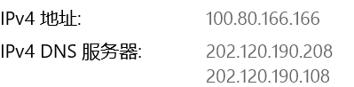
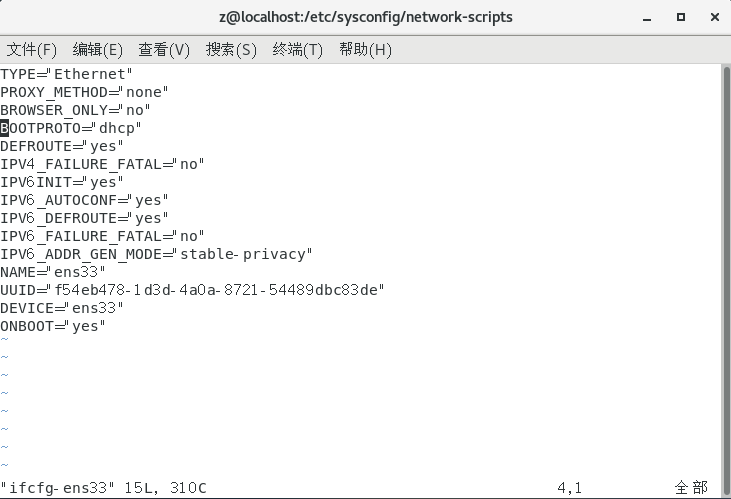
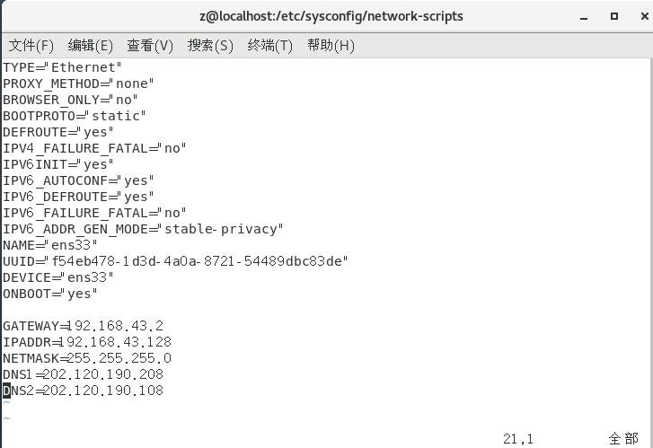

### CentOS配置静态路由

查看本机（物理机）IP和DNS Server：




将`BOOTPROTO`改为`static`，并添加内容：



改为：




### SSH免密登录

#### 配置SSH

切换至用户`hadoop`，用`Master`访问`Slave1`：

```bash
[hadoop@Master .ssh]$ ssh Slave1
```

此时需要密码，访问后二者均出现`.ssh`文件

显示隐藏文件可以看到`.ssh`：

```bash
[hadoop@Master ~]$ ls -a
```

退出：

```bash
[hadoop@Slave1 ~]$ exit
```

或快捷键`Ctrl+D`

#### 免密登录实现

生成公钥（`id_rsa.pub`）和私钥（`id_rsa`）

```bash
[hadoop@Master .ssh]$ ssh-keygen -t rsa
Generating public/private rsa key pair.
```

然后根据提示敲回车和y

```bash
cd ~/.ssh
cat id_rsa.pub >> authorized_keys
chmod 644 authorized_keys
```

测试一下本机无密码登录：

```bash
sudo service sshd restart
ssh Master
```

免密登录本机成功：

```bash
[hadoop@Master .ssh]$ ssh Master
Last login: Tue Nov 21 11:27:41 2023
```

将公钥拷贝至将要免密登录的目标机器，这里是`Slave1`：

```bash
[hadoop@Master .ssh]$ ssh-copy-id Slave1
```

此时已经可以免密登录`Slave1`

在`Slave1`上执行同样操作后，`Slave1`也可以免密登录`Master`

### JDK

#### 卸载OpenJDK

查看版本：

```bash
[z@Master ~]$ java -version
openjdk version "1.8.0_332"
OpenJDK Runtime Environment (build 1.8.0_332-b09)
OpenJDK 64-Bit Server VM (build 25.332-b09, mixed mode)
```

如果是最简安装则没有OpenJDK

进入root权限：

```bash
su root
```

用yum命令卸载：

```bash
yum -y remove java*
```

#### 安装JDK1.7

在[Oracle官网](https://www.oracle.com/java/technologies/javase/javase7-archive-downloads.html#jdk-7u80-oth-JPR)下载JDK1.7后放入共享文件夹，虚拟机中查看：

```bash
cd /mnt/hgfs/
```

解压：

```bash
tar -zxvf jdk-7u80-linux-x64.tar.gz -C /usr/java
```

会解压到`usr/java/jdk1.7.0_80`文件夹中

配置环境变量：

```bash
cd ~
vi ~/.bashrc
```

```sh
export JAVA_HOME=/usr/java/jdk1.7.0_80
export JRE_HOME=${JAVA_HOME}/jre
export CLASSPATH=.:${JAVA_HOME}/lib:${JRE_HOME}/lib
export PATH=${JAVA_HOME}/bin:$PATH
```

用source命令重新执文件：

```bash
source ~/.bashrc
```

检查是否成功：

```bash
[root@Master /]# java -version
java version "1.7.0_80"
Java(TM) SE Runtime Environment (build 1.7.0_80-b15)
Java HotSpot(TM) 64-Bit Server VM (build 24.80-b11, mixed mode)
```

#### 共享文件夹消失

```bash
sudo vmhgfs-fuse .host:/ /mnt/hgfs -o allow_other
```

如果报错则

```bash
sudo umount /mnt/hgfs
```

避免重启后重置：

```bash
sudo vi /etc/fstab
```

在最后加入

```bash
.host:/ /mnt/hgfs fuse.vmhgfs-fuse allow_other 0 0
```

重启


### Hadoop

[下载Hadoop2.10.2](https://archive.apache.org/dist/hadoop/common/hadoop-2.10.2/)

解压

```bash
tar -zxvf hadoop2.10.2.tar.gz -C /usr/hadoop
```

#### 配置Hadoop环境变量

```bash
vi /etc/profile
```

添加：

```sh
export HADOOP_HOME=/usr/hadoop/hadoop-2.10.2
export PATH=${HADOOP_HOME}/bin:${HADOOP_HOME}/sbin:$PATH
```

保存退出后重新加载文件：

```bash
source /etc/profile
```

此时可以查看到Hadoop版本：

```bash
[root@Master etc]# hadoop version
Hadoop 2.10.2
Subversion Unknown -r 965fd380006fa78b2315668fbc7eb432e1d8200f
Compiled by ubuntu on 2022-05-24T22:35Z
Compiled with protoc 2.5.0
From source with checksum d3ab737f7788f05d467784f0a86573fe
This command was run using /usr/hadoop/hadoop-2.10.2/share/hadoop/common/hadoop-common-2.10.2.jar
```

#### 修改Hadoop配置文件

```bash
cd /usr/hadoop/hadoop-2.10.2/etc/hadoop
```

1. ```bash
    vi hadoop-env.sh
    ```

    ```sh
    export JAVA_HOME=/usr/java/jdk1.7.0_80
    ```

2. ```bash
    vi core-site.xml
    ```

    ```xml
    <configuration>
    	<property>
    		<name>fs.defaultFS</name>
    		<value>hdfs://Master:9000</value>
    	</property>
    	<property>
    		<name>hadoop.tmp.dir</name>
    		<value>/usr/hadoop/hadoop-2.10.2/tmp</value>
    	</property>
    </configuration>
    ```

    value是`fs.defaultFS`的值，表示`hdfs`路径的逻辑名称

3. 先创建两个文件夹：

    ```bash
    mkdir /usr/hadoop/hadoop-2.10.2/name   
    mkdir /usr/hadoop/hadoop-2.10.2/data 
    ```

    回到`${HADOOP_HOME}/etc/hadoop/`下：

    ```bash
    vi hdfs-site.xml
    ```

    ```xml
    <configuration>
    	<property>		
    		<name>dfs.namenode.name.dir</name>
    		<value>/usr/hadoop/hadoop-2.10.2/name</value>
    	</property>
    	<property>
    		<name>dfs.datanode.data.dir</name>
    		<value>/usr/hadoop/hadoop-2.10.2/data</value>
    	</property>
    	<property>
    		<name>dfs.replication</name>
    		<value>2</value>
    	</property>
    </configuration>
    ```

4. ```bash
    cp mapred-site.xml.template mapred-site.xml
    vi mapred-site.xml
    ```

    ```xml
    <configuration>
    	<property>
    		<name>mapreduce.framework.name</name>
    		<value>yarn</value>
    	</property>
    </configuration>
    ```

5. ```bash
    vi yarn-site.xml
    ```

    ```xml
    <configuration>
    	<property>
    		<name>yarn.nodemanager.aux-services</name>
    		<value>mapreduce_shuffle</value>
    	</property>
    	<property>
    		<name>yarn.nodemanager.aux-services.mapreduce_shuffle.class</name>
    		<value>org.apache.hadoop.mapred.ShuffleHandler</value>
    	</property>
    	<property>
    		<name>yarn.resourcemanager.hostname</name>
    		<value>Master</value>
    	</property>
    </configuration>
    ```

6. ```bash
    vi slaves
    ```

    ```
    Slave1
    ```

7. 通过`scp`命令将配置从Master拷贝到Slave上，需要切换回hadoop用户：

    ```bash
    scp -r /usr/hadoop/hadoop-2.10.2/etc/hadoop Slave1:/usr/hadoop/hadoop-2.10.2/etc
    ```

    Slave上也创建文件夹：

    ```bash
    mkdir /usr/hadoop/hadoop-2.10.2/name   
    mkdir /usr/hadoop/hadoop-2.10.2/data 
    ```

8. 在格式化`hdfs`之前最好关闭防火墙：

    ```bash
    systemctl stop firewalld.service
    ```

9. 格式化`hdfs`：

    ```bash
    cd /usr/hadoop/hadoop-2.10.2/bin
    hadoop namenode -format
    ```

    格式化时可能报错：

    ```bash
    Cannot remove current directory: /usr/hadoop/hadoop-2.10.2/name/current
    ```

    解决方法是直接root删掉

    ```bash
    sudo rm -rf /usr/hadoop/hadoop-2.10.2/name/current
    ```

    又报错：

    ```bash
    java.io.IOException: Cannot create directory /usr/hadoop/hadoop-2.10.2/name/current
    ```

    权限不够就给权限：

    ```bash
    su root
    sudo chown -R hadoop /usr/hadoop
    su hadoop
    ```

#### 启动Hadoop

1. 启动：

    ```bash
    cd /usr/hadoop/hadoop-2.10.2/sbin
    start-all.sh
    ```

2. 关闭：

       ```bash
       cd /usr/hadoop/hadoop-2.10.2/sbin
       stop-all.sh
       ```

3. 报错：

      ```bash
      java.io.FileNotFoundException: /usr/hadoop/hadoop-2.10.2/logs/yarn-hadoop-resourcemanager-Master.log (权限不够)
      	at java.io.FileOutputStream.open(Native Method)
      	at java.io.FileOutputStream.<init>(FileOutputStream.java:221)
      	at java.io.FileOutputStream.<init>(FileOutputStream.java:142)
      	at org.apache.log4j.FileAppender.setFile(FileAppender.java:282)
      	at org.apache.log4j.RollingFileAppender.setFile(RollingFileAppender.java:200)
      	at org.apache.log4j.FileAppender.activateOptions(FileAppender.java:166)
      	at org.apache.log4j.config.PropertySetter.activate(PropertySetter.java:284)
      	at org.apache.log4j.config.PropertySetter.setProperties(PropertySetter.java:160)
      ```

      权限不足，给权限就好：

      ```bash
      su root
      chown hadoop /usr/hadoop/hadoop-2.10.2/logs/yarn-hadoop-resourcemanager-Master.log
      ```

4. 运行成功后用`jps`查看进程：

     ```bash
     [hadoop@Master sbin]$ jps
     6590 Jps
     6134 SecondaryNameNode
     6310 ResourceManager
     5905 NameNode
     ```

      `Master`节点的`NameNode`创建成功

     有可能`Namenode`、`DataNode`消失，查日志：

     ```bash
     tail -n 50 $HADOOP_HOME/logs/hadoop-hadoop-namenode-Master.log
     ```

     看到：

     ```bash
     2023-11-23 13:39:49,088 INFO org.apache.hadoop.util.ExitUtil: Exiting with status 1: org.apache.hadoop.hdfs.server.common.InconsistentFSStateException: Directory /usr/hadoop/hadoop-2.10.2/name is in an inconsistent state: storage directory does not exist or is not accessible.
     ```

     可能是权限问题，回到格式化那一步解决

     也有可能是锁的问题，把报错的锁直接删除即可

5. SSH连接上`Slave1`后同样用`jps`查看：

     ```bash
     [hadoop@Slave1 ~]$ jps
     2848 Jps
     2577 DataNode
     2694 NodeManager
     ```

     `DataNode`若消失，查看日志：

     ```bash
     tail -n 50 $HADOOP_HOME/logs/hadoop-hadoop-datanode-Slave1.log
     ```

     ```bash
     Exception checking StorageLocation [DISK]file:/usr/hadoop/hadoop-2.10.2/data/
     org.apache.hadoop.util.DiskChecker$DiskErrorException: Directory is not readable: /usr/hadoop/hadoop-2.10.2/data
     ```

     还是权限问题

     ```bash
     su root
     sudo chown -R hadoop /usr/hadoop
     su hadoop
     ```


### MySQL

#### 下载安装MySQL

查看是否有安装，如果有则删除：

```bash
rpm -qa|grep mysql*
```

查看服务器期初架构是arm还是x86以及操作系统（CentOS基于Red Hat开发）：

```bash
[hadoop@Master /]$ uname -m
x86_64
[hadoop@Master /]$ cat /etc/redhat-release
CentOS Linux release 7.9.2009 (Core)
```

[MySQL Community官网下载](https://dev.mysql.com/downloads/mysql/)

选择对应的版本，我这里是`Red Hat Enterprise Linux 7 / Oracle Linux 7 (x86, 64-bit)`，下载下方的`RPM Bundle`

```bash
sudo mkdir /usr/mysql
sudo tar -xvf mysql-8.0.35-1.el7.x86_64.rpm-bundle.tar -C /usr/mysql
```

删除原有的mariadb以免报错：

```bash
[hadoop@Master /]$ rpm -qa|grep mariadb
mariadb-libs-5.5.68-1.el7.x86_64
```

删除：

```bash
sudo rpm -e --nodeps mariadb-libs
```

安装解压得到的rpm包：

```bash
cd /usr/myqsl
sudo rpm -Uvh *.rpm --nodeps --force
```

查看一下装到哪去了：

```bash
ps -ef|grep mysql
```

守护进程`mysqld`在`/usr/sbin/mysqld`

#### 启动MySQL

检测服务状态：

```bash
systemctl status mysqld
```

```bash
[hadoop@Master mysql]$ systemctl status mysqld
● mysqld.service - MySQL Server
   Loaded: loaded (/usr/lib/systemd/system/mysqld.service; enabled; vendor preset: disabled)
   Active: inactive (dead)
     Docs: man:mysqld(8)
           http://dev.mysql.com/doc/refman/en/using-systemd.html
```

启动MySQL服务：

```bash
systemctl start mysqld
```

再次查看服务状态：

```bash
qld.service - MySQL Server
   Loaded: loaded (/usr/lib/systemd/system/mysqld.service; enabled; vendor preset: disabled)
   Active: active (running) since 二 2023-11-28 09:00:17 CST; 4s ago
     Docs: man:mysqld(8)
           http://dev.mysql.com/doc/refman/en/using-systemd.html
  Process: 4527 ExecStartPre=/usr/bin/mysqld_pre_systemd (code=exited, status=0/SUCCESS)
 Main PID: 4606 (mysqld)
   Status: "Server is operational"
    Tasks: 38
   CGroup: /system.slice/mysqld.service
           └─4606 /usr/sbin/mysqld
```

查看初始密码：

```bash
vi /var/log/mysqld.log
```

找到临时密码：

```
2023-11-28T01:00:14.048440Z 6 [Note] [MY-010454] [Server] A temporary password is generated for root@localhost: ;rv_7>Ebbnm#
```

修改密码：

```bash
mysqladmin -u root -p password
```

登录：

```bash
mysql -uroot -p 
```

root账号一般只添加了localhost访问：

```mysql
mysql> SELECT host FROM mysql.user WHERE user='root';
+-----------+
| host      |
+-----------+
| localhost |
+-----------+
1 row in set (0.00 sec)
```

如果想要可以允许任何IP访问，可以新建一个账号：

```mysql
mysql> CREATE USER 'mysql' IDENTIFIED BY '123456';
mysql> GRANT ALL PRIVILEGES ON *.* TO 'mysql';
mysql> FLUSH PRIVILEGES;
```

查看一下：

```mysql
mysql> SELECT host FROM mysql.user WHERE user='mysql';
+------+
| host |
+------+
| %    |
+------+
1 row in set (0.01 sec)
```

#### 密码不能太简单的解决方法

修改密码时报错：

```bash
mysqladmin: unable to change password; error: 'Your password does not satisfy the current policy requirements'
```

先登录：

```bash
mysql -uroot -p 
```

修改设置：

```mysql
mysql> set global validate_password.policy=0;
mysql> set global validate_password.length=1;
mysql> exit
```

如果又报错了：

```mysql
ERROR 1820 (HY000): You must reset your password using ALTER USER statement before executing this statement.
```

就只能按他说的做了，先用复 杂的密码建个用户：

```mysql
mysql> ALTER USER user() IDENTIFIED BY ';rv_7>Ebbnm#';
```

再修改就不报错：

```mysql
mysql> set global validate_password.policy=0;
mysql> set global validate_password.length=1;
mysql> exit
```

退出后再次修改密码：

```bash
mysqladmin -u root -p password
```

此时可以设定123456之类的简单密码


###  Hive

#### 安装Hive

[Hive官网](https://dlcdn.apache.org/hive/)

对于Hadoop2选择Hive2，Hadoop3选择Hive3

```bash
sudo mkdir /usr/hive
sudo tar -zxvf apache-hive-2.3.9-bin.tar.gz -C /usr/hive
```

添加环境变量：

```bash
sudo vi /etc/profile
```

```
export HIVE_HOME=/usr/hive/apache-hive-2.3.9-bin
export PATH=$PATH:$HIVE_HOME/bin
```

```bash
source /etc/profile
```

检测安装成功：

```bash
[hadoop@Master /]$ hive --version
Hive 2.3.9
Git git://chaos-mbp.lan/Users/chao/git/hive -r 92dd0159f440ca7863be3232f3a683a510a62b9d
Compiled by chao on Tue Jun 1 14:02:14 PDT 2021
From source with checksum 6715a3ba850b746eefbb0ec20d5a0187
```

#### 配置Hive

在`HIVE_HOME`下创建目录以存放临时文件：

```bash
cd $HIVE_HOME
sudo mkdir tmp
```

启动Hadoop

```bash
$HADOOP_HOME/sbin/start-all.sh
```

创建一个MySQL账号给Hive用：

```mysql
mysql> CREATE USER 'hive' IDENTIFIED BY 'hive';
mysql> GRANT ALL PRIVILEGES ON *.* TO 'hive';
mysql> FLUSH PRIVILEGES;
```

在`$HIVE_HOME/conf`下复制模版创建`hive-site.xml`并修改部分参数：

```bash
cd $HIVE_HOME/conf
sudo cp hive-default.xml.template hive-site.xml
sudo vi hive-site.xml
```

MySQL相关：

```xml
<property> 
    <name>javax.jdo.option.ConnectionDriverName </name> 
    <value>com.mysql.jdbc.Driver </value> 
</property>

<property> 
    <name>javax.jdo.option.ConnectionURL </name> 
    <value>jdbc:mysql://Master:3306/hive?useUnicode=true&amp;serverTimezone=UTC&amp;characterEncoding=utf8&amp;useSSL=false </value> 
</property> 
 
<property>
    <name>javax.jdo.option.ConnectionUserName</name>
    <value>hive</value>
    <description>Username to use against metastore database</description>
</property>

<property> 
    <name>javax.jdo.option.ConnectionPassword </name> 
    <value>hive</value> 
    <description>password to use against metastore database</description>
</property> 
```

`ConnectionURL`填MySQL数据库的地址，也可以用其他虚拟机的MySQL，对于MySQL 8.0需要添加时区，`ConnectionUserName`和`ConnectionPassword`需要和之前创建的MySQL账号密码相同。

缓存相关：

```xml
<property>
    <name>hive.exec.local.scratchdir</name>
    <value>/usr/hive/apache-hive-2.3.9-bin/tmp/${system:user.name}</value>
    <description>Local scratch space for Hive jobs</description>
</property>
<property>
    <name>hive.downloaded.resources.dir</name>
    <value>/usr/hive/apache-hive-2.3.9-bin/tmp/${hive.session.id}_resources</value>
    <description>Temporary local directory for added resources in the remote file system.</description>
</property>
<property>
    <name>hive.server2.logging.operation.log.location</name>
    <value>/usr/hive/apache-hive-2.3.9-bin/tmp/${system:user.name}/operation_logs</value>
    <description>Top level directory where operation logs are stored if logging functionality is enabled</description>
</property>
```

创建文件`hive-env.sh`：

```bash
sudo cp hive-env.sh.template hive-env.sh
```

下载MySQL和java的连接jar包（[官网](https://dev.mysql.com/downloads/connector/j/)）并安装：

```bash
sudo rpm -ivh mysql-connector-j-8.2.0-1.el7.noarch.rpm
```

报错，缺少`java headless`：

```
错误：依赖检测失败：
	java-headless >= 1:1.8.0 被 mysql-connector-j-1:8.2.0-1.el7.noarch 需要
```

安装`java-headless`后再次安装连接包：

```bash
sudo yum -y install java-headless
sudo rpm -ivh mysql-connector-j-8.2.0-1.el7.noarch.rpm
```

找到安装路径：

```bash
rpm -qa|grep mysql-connector
rpm -ql mysql-connector-j-8.2.0-1.el7.noarch
```

到对应位置把jar包复制到`$HIVE_HOME/lib`下：

```bash
sudo cp /usr/share/java/mysql-connector-j.jar $HIVE_HOME/lib/mysql-connector-j.jar
sudo cp /usr/share/java/mysql-connector-java.jar $HIVE_HOME/lib/mysql-connector-java.jar
```


#### 启动Hive

初始化命令

```bash
schematool -dbType mysql -initSchema
```

启动（MySQL和Hadoop已启动）：

```bash
hive
```

可能会有权限问题，与安装Hadoop时类似地`chown`一下即可                

```
FAILED: SemanticException org.apache.hadoop.hive.ql.metadata.HiveException: java.lang.RuntimeException: Unable to instantiate org.apache.hadoop.hive.ql.metadata.SessionHiveMetaStoreClient
```

报这个错大概是因为之前的MySQL账号密码和权限配置错误

