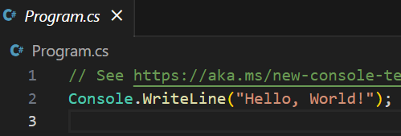
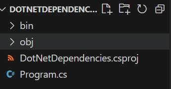

# .NET学习

官方文档：[.NET文档](https://learn.microsoft.com/zh-cn/dotnet/fundamentals/)   [下载.NET](https://dotnet.microsoft.com/zh-cn/download)   [教程文档](https://learn.microsoft.com/zh-cn/training/modules/dotnet-dependencies)   [NuGet 文档](https://learn.microsoft.com/zh-cn/nuget/)   [.NET CLI 文档](https://learn.microsoft.com/zh-cn/dotnet/core/tools/)

.NET是

## 创建示例.NET项目并使用依赖项

### 创建示例.NET项目

这里使用 .NET7.0 SDK 和 Visual Studio Code（安装C#拓展）

运行以下命令确保已经安装.NET7.0：

```
dotnet --list-sdks
```

得到输出：

```
7.0.203 [C:\Program Files\dotnet\sdk]
```

创建名为 DotNetDependencies 的新文件夹，在终端窗口中输入以下命令：

```
dotnet new console -f net7.0
```

此命令会在文件夹中创建一个 Program.cs 文件（内附已编写的基本“Hello World”程序），还将创建一个名为 DotNetDependencies.csproj 的 C# 项目文件。



在终端窗口中，使用以下命令来运行程序：

```
dotnet run
```

### 安装和使用依赖项

要查找已经安装的依赖项，运行以下命令：

```
dotnet list package
```

通过运行以下命令安装 Humanizer 库（可以使用 --version 安装指定版本）：

```
dotnet add package Humanizer
```

打开 DotNetDependencies.csproj 文件可以找到 `ItemGroup` 部分：

```xml
<ItemGroup>
    <PackageReference Include="Humanizer" Version="2.14.1" />
</ItemGroup>
```

重写 Program.cs 文件：

```c#
using Humanizer;

static void HumanizeQuantities()
{
    Console.WriteLine("case".ToQuantity(0));
    Console.WriteLine("case".ToQuantity(1));
    Console.WriteLine("case".ToQuantity(5));
}

static void HumanizeDates()
{
    Console.WriteLine(DateTime.UtcNow.AddHours(-24).Humanize());
    Console.WriteLine(DateTime.UtcNow.AddHours(-2).Humanize());
    Console.WriteLine(TimeSpan.FromDays(1).Humanize());
    Console.WriteLine(TimeSpan.FromDays(16).Humanize());
}

Console.WriteLine("Quantities:");
HumanizeQuantities();

Console.WriteLine("\nDate/Time Manipulation:");
HumanizeDates();
```

运行得到如下输出：

```
Quantities:
0 cases
1 case 
5 cases

Date/Time Manipulation:
昨天
2 小时前
1 天
2 周
```

依赖项已经正确安装并使用。

### 使用 VSCode 调试

调试控制台不接受正在运行的程序的终端输入，若要在调试时处理终端输入，可以使用集成终端（Visual Studio Code 窗口之一）或外部终端。 这里使用集成终端：

打开 .vscode/launch.json 并更改 `console` 设置。

从

```json
"console": "internalConsole",
```

到

```json
"console": "integratedTerminal",
```

